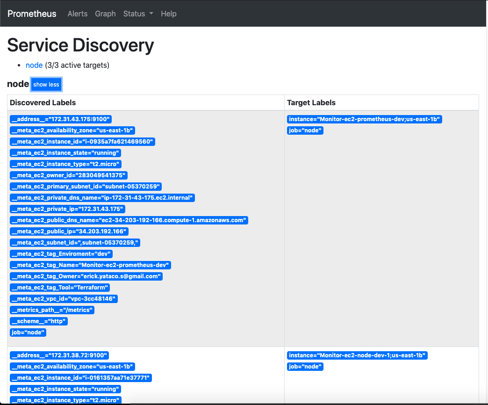
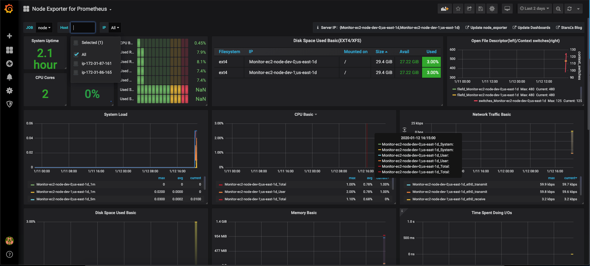

# Monitoring EC2 Instnaces

Terraform module that provision EC2 instances (monitored) with node exporter to export metrics to Promehteus server (monitor)
and 

## Prometheus EC2 Service Discovery

To allow Prometheus Services discovery scrap metrics over monitored instances we need to attached a role with the necesary permissions 

[ec2-monitor.tf](modules/ec2-monitor/ec2-monitor.tf#L5-L19)
```
  assume_role_policy = <<EOF
{
  "Version": "2012-10-17",
  "Statement": [
    {
      "Action": "sts:AssumeRole",
      "Principal": {
        "Service": "ec2.amazonaws.com"
      },
      "Effect": "Allow",
      "Sid": ""
    }
  ]
}
EOF
```



## Dashboard example

We uses https://grafana.com/grafana/dashboards/11074 

